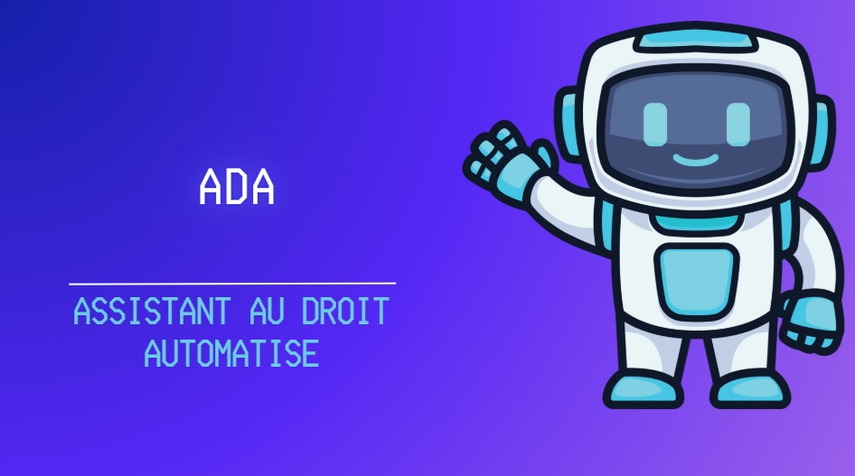
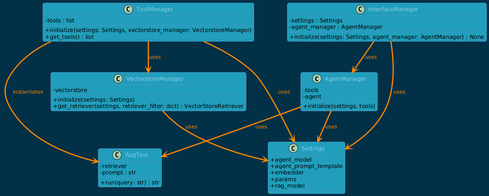
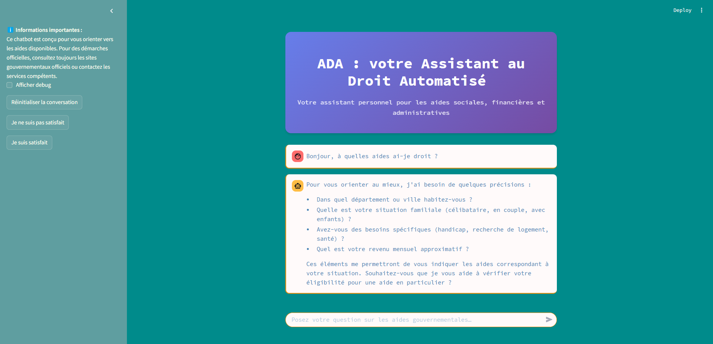

# 🤖 Agent IA citoyen (ADA-ChatBot) avec langchain 

Ce projet vise à concevoir un assistant conversationnel intelligent capable de répondre en langage naturel à des questions portant sur les droits sociaux et administratifs, à partir de documents institutionnels publics.

 Il utilise les outils LangChain, une architecture RAG pour la recherche contextuelle, un agent IA pour la gestion des outils personnalisés, une mémoire conversationnelle pour maintenir le fil du dialogue, et une interface Streamlit claire et fluide.

Ce projet a été réalisé par [Charles](https://github.com/CpHeat), [Louis](https://github.com/lougail) et [Sayana](https://github.com/sayana-project) lors de la formation Dev IA chez Simplon HDF-Lille.

- Pour en savoir plus sur les agent IA, consultez [cette page Wikipedia](https://fr.wikipedia.org/wiki/Agent_intelligent).

**🎯 Objectif du projet**

Ce prototype simule un assistant numérique dans un contexte réel de service publique, permettant à un citoyen de :

- Trouver des informations claires et contextualisées sur ses droits (ex. aides au logement, handicap, aides à l'enfance).

- Poser des questions complexes (ex. éligibilité, résumé de procédures).

- Utiliser des outils intégrés (résumé, simplification, évaluation d’éligibilité).

- Restreindre la recherche à un domaine pour améliorer la pertinence.

- Dialoguer facilement via une interface web.

Ce projet est réalisé dans le cadre de la formation Dev IA – Simplon HDF - Lille.
## 🏗️ Architecture & Composants IA



1. RAG (Retrieval-Augmented Generation)
- Recherche dans des documents vectorisés (ChromaDB).

- Fournit des sources fiables aux réponses.

2. Agent IA (LangChain Agent)
- Analyse la requête.

- Utilise les outils personnalisés (éligibilité, simulation, démarches).

- Coordination avec la mémoire et la base documentaire.

3. Mémoire conversationnelle
- Maintient le contexte de la discussion.

- Permet des interactions naturelles et suivies.

4. Interface utilisateur (Streamlit)
- Permet au citoyen d'interagir avec l'assistant.

- Proposition automatique de restreindre un domaine de recherche.

- UI pensée pour la clarté, l'accessibilité et la fluidité.
## Arborescence du projet

Voici l'aborescence du projet pour mieux localiser certains fichiers : 
- **.streamlit/** : Dossier contenant le thème personalisé Streamlit
- **classes/** : Dossier contenant les documents d'information sur les aides et droits français.
  - **`agent_manager.py** : Classe qui permet d'exécuter l'agent.
  - **interface_manager.py** : Classe qui permet la mise en place interface chatbot agent tool.
  - **rag_tool.py** : Classe d'outils pour accéder au database vecteur RAG.
  - **settings.py** : Classe qui permet d'acéder au variable de paramètre.
  - **tool_manager.py** : Classe qui permet de gérer les outils du RAG.
  - **vectorstore_manager.py** : Classe qui permet de la mise en place du DB vectoriser
- **data/** : Dossier contenant les documents d'information sur les aides et droits français.
  - **aides au logement/** : Dossier contenant les documents d'aides au logement.
  - **aides au handicap/** : Dossier contenant les documents d'aides aux handicapés.
  - **aides à la parentalité/** : Dossier contenant les documents d'aides aux enfants.
  - **aides santé/** : Dossier contenant les documents d'aides à la santé.
- **db/** : Dossier contenant la vectorisation des documents en db.
- **main.py** : Point d'entrée de l'application.
- **requirements.txt**: fichier txt avec les dépendances Python
- **README.md** : Documentation du projet.

## Pré-requis et utilisation

**Installation d'Ollama**
aller sur https://ollama.com/ .
Télécharger exe et installer.
dans une console faire la commande suivante pour vérifier que l'installation s'est bien effectuée
```
ollama --version
```
Puis installer le modèle mxbai-embed-large (utilisé pour la vectorisation)
```
ollama pull mxbai-embed-large
```
**Récupérer le projet chatbot**
```bash
git clone https://github.com/CpHeat/ai-agent-with-langchain.git
```
**Créer un fichier .env à la racine contenant une clé API DeepSeek**
```python
DEEPSEEK_API_KEY=**********
```
**Ouvrir le projet avec VSCode ou PyCharm**
**Créer un environnement virtuel Python 3.13**
**depuis le terminal dans le dossier du projet**
**Installer les dépendances**
```bash
pip install -r requirements.txt --no-cache-dir
```
**Lancer l’interface utilisateur**
```python
streamlit run main.py
```



## 📄 Thème choisi

**Accès aux droits** : notre assistant se concentre sur la compréhension des droits sociaux et administratifs dans les domaines suivants :

- Aides au logement.

- Aides pour personnes en situation de handicap.

- Aides pour familles et enfants

## 🛠️ Choix techniques

🛠️ Choix techniques
Nous avons fait les choix suivants pour construire un agent IA robuste, modulaire et facilement évolutif :

⚙️ 1. Architecture modulaire (multi-classes Python)
- Séparation claire des responsabilités via des classes (AgentManager, VectorStoreManager, ToolManager, etc.).

- Facilite la maintenance, les tests et l'ajout futur de nouvelles fonctionnalités.

🔍 2. Recherche contextuelle (RAG - Retrieval Augmented Generation)
- Vectorisation des documents institutionnels avec ChromaDB pour permettre une recherche rapide et pertinente.

- LangChain Retriever avec similarité cosinus pour fournir du contexte utile à l’agent IA.

🤖 3. Agent LangChain + outils personnalisés
Utilisation d’un agent LangChain pour gérer la logique de dialogue et le choix d’outils à chaque étape.

Intégration d’outils sur mesure :

- Calcul d’éligibilité (revenu, logement, etc.)
- Recherche de démarches
- Calcul montant d'aide

🧠 4. Mémoire conversationnelle
Utilisation de ConversationBufferMemory pour conserver l'historique de la discussion.

Permet des échanges plus naturels et du suivi de contexte sur plusieurs questions.

🖥️ 5. Interface avec Streamlit
Interface simple et épurée pour permettre une expérience fluide au citoyen.

Proposition contextuelle de filtre par domaine (logement, handicap, etc.) dès les premières interactions.

🔒 6. Prompt engineering structuré
Création d’un prompt agent clair et encadré :

- Rôle, stratégie de réponse, format d’action/observation.

- Demande de clarification quand le contexte est insuffisant.

- Adapté aux outils LangChain (supporte {tools}, {tool_names}, {agent_scratchpad}).

💡 Améliorations futures
Ce prototype peut être enrichi par plusieurs fonctionnalités pour se rapprocher d’un assistant numérique réellement opérationnel dans un contexte de service public :

📆 1. Prise de rendez-vous avec un organisme public
Permettre à l'utilisateur de réserver un créneau auprès de la CAF, MDPH, CPAM ou autre structure.

Intégration possible via des API publiques ou formulaires dynamiques en ligne.

📧 2. Envoi automatique d’e-mails
Génération d’un e-mail personnalisé contenant les informations discutées avec l’assistant.

Envoi à l’organisme compétent (ex. : mairie, CAF), en s’appuyant sur les contacts extraits depuis les documents du RAG.

🧾 3. Génération automatique de justificatifs ou courriers types
Création de documents administratifs préremplis (attestations, lettres de motivation pour une aide, etc.).

Export au format PDF ou DOCX.

## 👥 Contributions des membres de l'équipe
- **[Charles](https://github.com/CpHeat)**:
  - Récupération des données & structuration des dossiers.
  - Vectorisation et mise en place du système RAG
  - Manipulation et creation d'outils RAG.
  - Coordination entre RAG et agent.
  - Refactorisation et clarté du code.
  - Intégration des outils agent personnalisés.
  - Debugging
    
- **[Louis](https://github.com/lougail)**: 
    - Développement de l’interface Streamlit (UI/UX).
    - Intégration de l’agent IA dans l’interface.
    - Tests de communication avec le backend IA.

- **[Sayana](https://github.com/sayana-project)**: 
    - Implémentation de l’agent conversationnel.
    - Prompting, mémoire conversationnelle.
    - Création et intégration des outils agent personnalisés.
    - 
## License

[MIT](https://choosealicense.com/licenses/mit/)

