# TP1 solution

Les 7 questions :

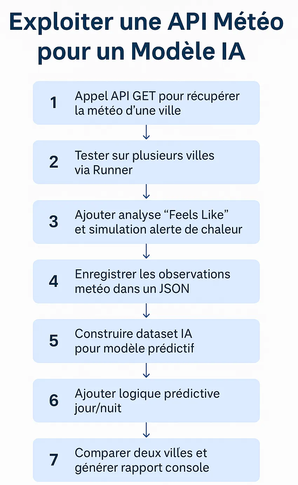

Avant toute chose dans votre environnement il faut renseigner :

- `base_url` = `https://api.openweathermap.org/data/2.5`
- `apikey` = ********
- `city` = `Paris`

### **Question 1 — Interroger une API publique (OpenWeatherMap)**

- Défini une **URL dynamique** dans Postman avec des variables d’environnement (`{{base_url}}`, `{{city}}`, `{{apikey}}`)
- Interrogé l’API pour **récupérer les données météo d’une seule ville** (ex. : Paris)
- Obtenu une **réponse JSON** contenant les infos météo

**Objectif** : apprendre à interroger une API avec des paramètres dynamiques.

**La question :** 

**Modifiez la requête actuelle** pour interroger dynamiquement plusieurs villes successivement via le Runner de Postman. Comment automatiser cela sans modifier la requête à chaque fois ?

**La réponse** 

Tester sur Paris uniquement : 

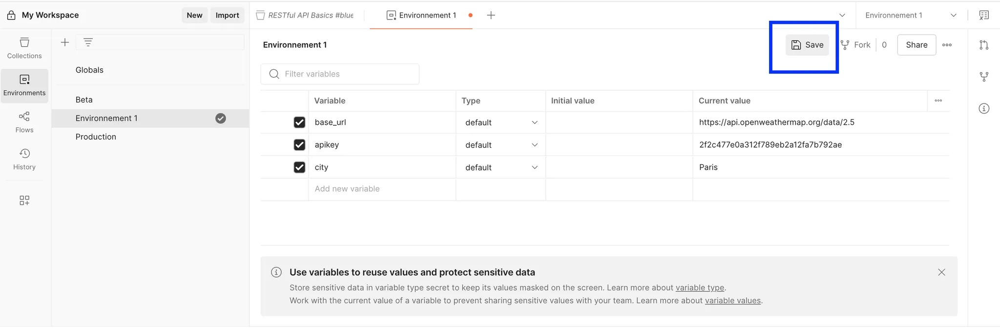


Tester sur plusieurs villes 

Dans Vscode : 

- Créer un fichier Json : cities.json :

```json
[
  { "city": "Paris" },
  { "city": "Tokyo" },
  { "city": "New York" },
  { "city": "Alger" },
  { "city": "Montréal" }
]
```

Dans collection > clic droit > Run > vérifiez que le .json est bien sélectionné 

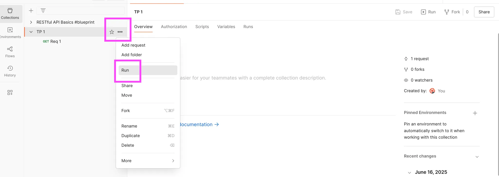

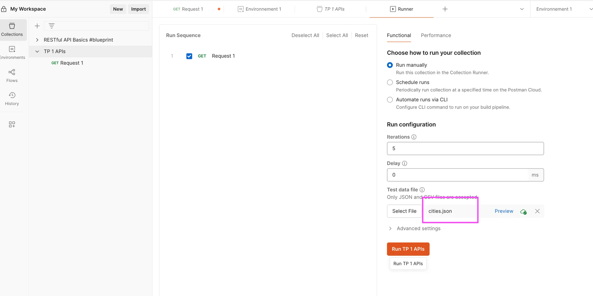

Revenir dans Environnement et vider la colonne current value de la variable city :

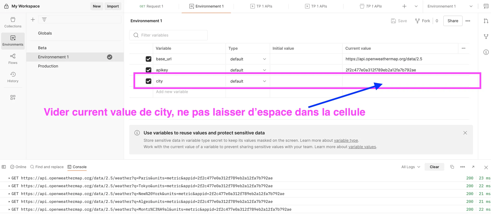

Save l’environnement 

- Clique droit sur la collection → **Run Collection**.
- Sélectionne ton fichier `cities.json`.
- Vérifie que l’environnement actif est bien `Environnement 1`.
- Clique sur **Run**.

---

### **Question 2 — Exploiter une donnée météo précise (weather[0].main)**

- Extrait le champ `weather[0].main` (ex. : "Rain", "Clear", etc.)
- Stocké la valeur dans une **variable d’environnement Postman** (`lastWeather`)
- Écrit un petit script conditionnel qui **affiche un message météo adapté** dans la console

Objectif : **commencer à exploiter le contenu d’une réponse JSON**.

Question 2 :
**Stockez dans une variable d’environnement** la description de la météo (`weather[0].main`). Proposez ensuite un script conditionnel qui affiche un message spécifique selon les cas (`Rain`, `Clear`, etc.).

**Explication** : 

Dans le fichier JSON que Postman affiche quand on lance un Run, le champ weather[0].main résume la météo : Clear, Rain, Snow, etc.
On doit récupérer ces mots pour les stocker dans une variable Postman appelée lastWeather, puis écrire un petit script qui affiche un message personnalisé selon la météo.

| Onglet | Quand il s’exécute | À quoi ça sert ? |
| --- | --- | --- |
| **Pre-request** | **Avant** d’envoyer la requête | Préparer ou modifier des données avant l’envoi (ex : générer un token, définir une variable dynamique, modifier des en-têtes, etc.) |
| **Post-response (Tests)** | **Après** avoir reçu la réponse | Lire et tester la réponse, stocker des valeurs, afficher des messages, ou vérifier que la réponse est correcte |

**Réponse** : 

Je fais le test pour une seule ville : Tokyo 

Dans l'environnement ajouter Tokyo 

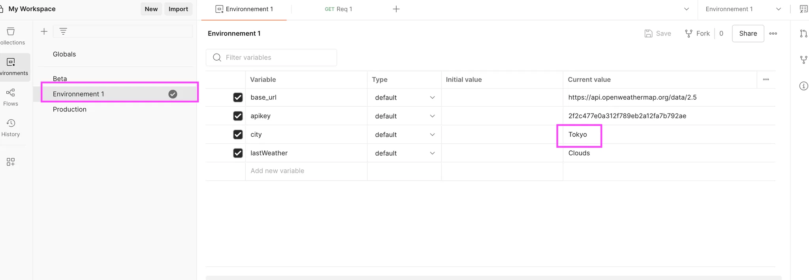

Dans Scripts : post response :

```json
let data;

try {
    data = pm.response.json();
} catch (e) {
    console.log("Erreur : la réponse n’est pas au format JSON.");
    return;
}

if (
    data &&
    data.hasOwnProperty("weather") &&
    Array.isArray(data.weather) &&
    data.weather.length > 0
) {
    const weatherMain = data.weather[0].main;
    pm.environment.set("lastWeather", weatherMain);

    if (weatherMain === "Clear") {
        console.log("Temps clair aujourd’hui, ciel dégagé.");
    } else if (weatherMain === "Rain") {
        console.log("Temps pluvieux. Pensez à prendre un parapluie.");
    } else if (weatherMain === "Clouds") {
        console.log("Le ciel est couvert aujourd’hui.");
    } else if (weatherMain === "Snow") {
        console.log("Neige en cours. Conditions hivernales.");
    } else {
        console.log("Météo actuelle :", weatherMain);
    }
} else {
    console.log("Données météo non disponibles. Code :", data.cod, "| Message :", data.message);
}

```

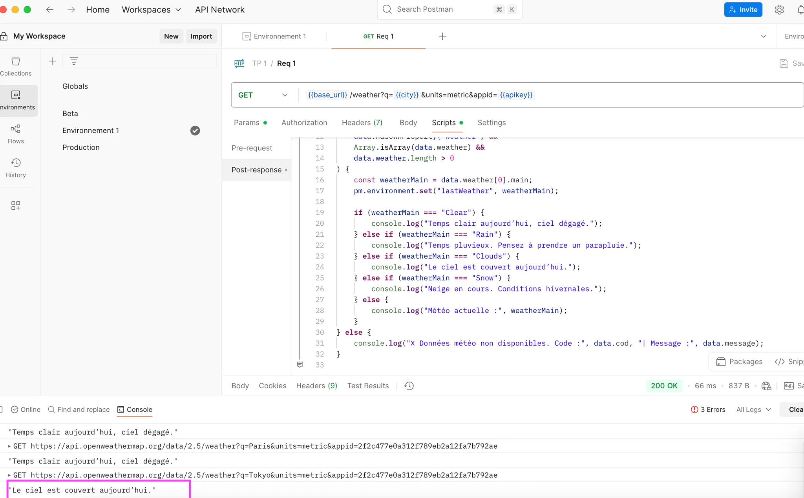

Test pour plusieurs villes :

On utilise le même script 

On ajoute un fichier .json dans 

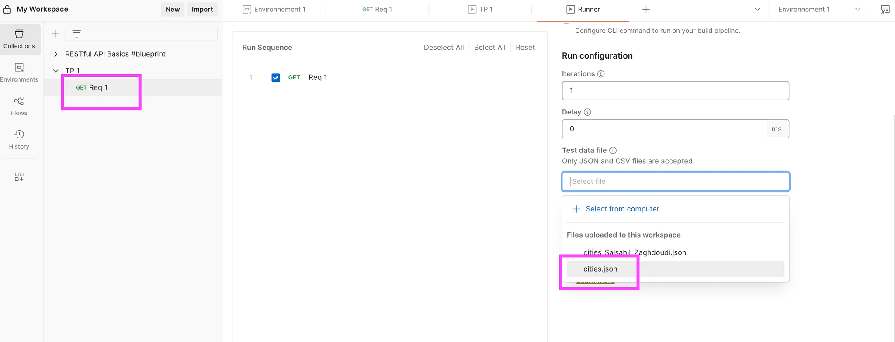

Je lance le Run 

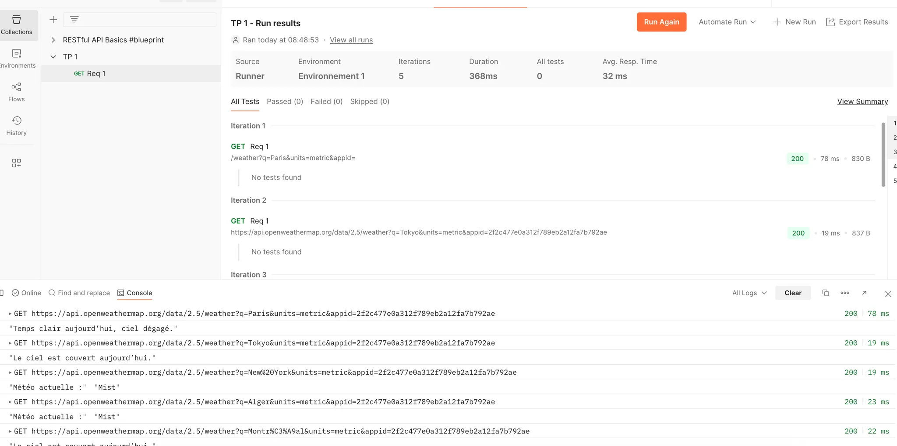

---

### **Question 3 — Analyser la température ressentie (feels_like)**

- Calculé la **différence entre `temp` et `feels_like`**
- Affiché cette différence dans la console
- Interprété ce que ça veut dire (ex. : humidité ou vent modifient la sensation réelle)

**Objectif** : comprendre que **les données météo sont subjectives**, et que des modèles IA peuvent justement apprendre cette nuance.

**Question 3** : **Exploitez la donnée `feels_like`** fournie dans le bloc `main`. Affichez dans la console la différence entre `temp` et `feels_like` et interprétez ce que cela peut signifier dans un système IA contextuel.

**La réponse** : 

Je procède de la même manière, je passe pour le Runner pour faire des tests sur plusieurs villes 

Il faut ajouter le code ci-dessous à la suite du code existant dans Script > Post Response :

```json
if (
    data.main &&
    typeof data.main.temp === "number" &&
    typeof data.main.feels_like === "number"
) {
    const temp = data.main.temp;
    const feelsLike = data.main.feels_like;
    const diff = Math.abs(temp - feelsLike).toFixed(1);

    console.log(`Température réelle : ${temp} °C`);
    console.log(`Température ressentie : ${feelsLike} °C`);
    console.log(`Écart ressenti : ${diff} °C`);

    // Interprétation IA simplifiée
    if (diff >= 3) {
        console.log("Interprétation : Les conditions atmosphériques (vent, humidité) modifient fortement la perception de la température.");
    } else if (diff >= 1) {
        console.log("Interprétation : Léger écart de ressenti, lié à l’humidité ou au vent.");
    } else {
        console.log("Interprétation : La température ressentie est quasiment identique à la température réelle.");
    }
} else {
    console.log("Les données 'temp' ou 'feels_like' ne sont pas disponibles.");
}
```

Save et ajouter le fichier cities.json dans le Runner et lancer le script 

**Résultat** : 

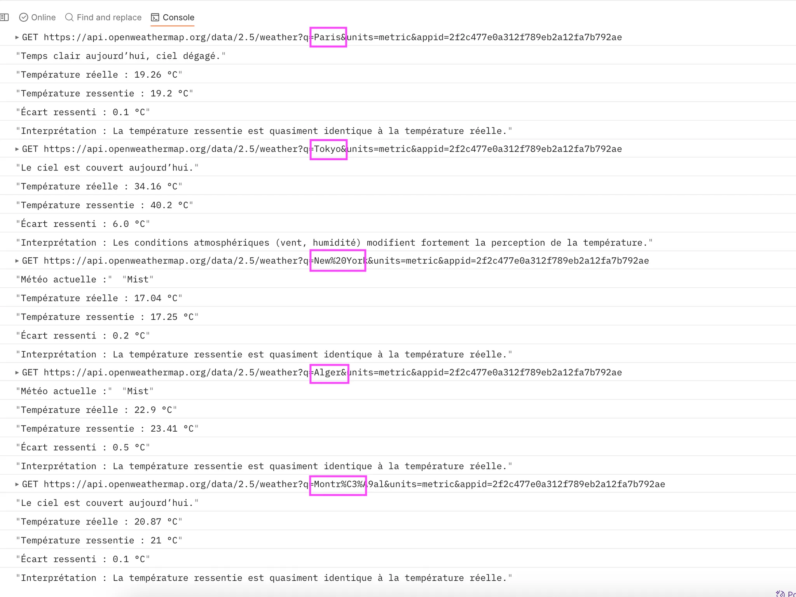

### **Question 4 — Construire un dataset JSON météo à partir de plusieurs villes**

- Utilisé un fichier `cities.json` contenant une liste de villes
- Automatisé la récupération météo pour chaque ville
- Stocké les résultats (ville, température, humidité, état du ciel) dans une **variable globale JSON** (`resultats_meteo`)
- Obtenu **un vrai mini-dataset**, structuré comme une base pour IA

**Objectif** : apprendre à **automatiser la collecte de données**, puis à **structurer ces données pour une IA**(classification, régression, etc.).

**La réponse :** 

créer une nouvelle variable d’environnement :

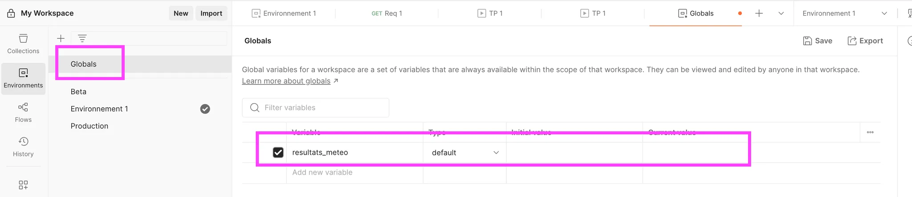

Ajouter le code ci-dessous à la suite du code existant dans post response 

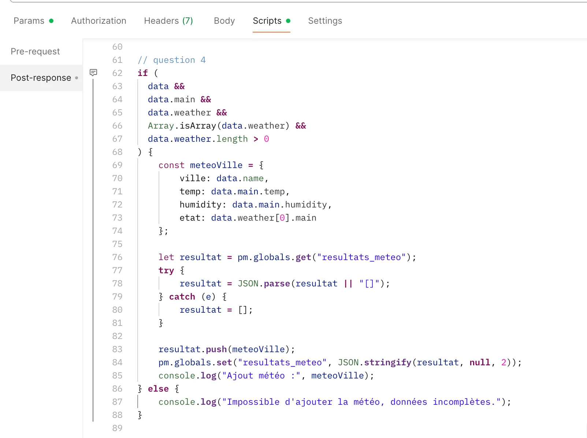

Ce que fait ce code :

- Il crée un petit objet `meteoVille` avec 4 infos : `ville`, `temp`, `humidity`, `etat`.
- Il récupère le tableau `resultats_meteo` (déjà existant).
- Il ajoute `meteoVille` dedans.
- Il met à jour la variable globale.
- Et il affiche un message dans la console.

```json
if (
  data &&
  data.main &&
  data.weather &&
  Array.isArray(data.weather) &&
  data.weather.length > 0
) {
    const meteoVille = {
        ville: data.name,
        temp: data.main.temp,
        humidity: data.main.humidity,
        etat: data.weather[0].main
    };

    let resultat = pm.globals.get("resultats_meteo");
    try {
        resultat = JSON.parse(resultat || "[]");
    } catch (e) {
        resultat = [];
    }

    resultat.push(meteoVille);
    pm.globals.set("resultats_meteo", JSON.stringify(resultat, null, 2));
    console.log("Ajout météo :", meteoVille);
} else {
    console.log("Impossible d'ajouter la météo, données incomplètes.");
}
```

lancer le test avec le Runner pour tester sur plusieurs villes 

Retournez dans Global, vous voyez que le résultat est stocké dans la variable resultas_meteo 

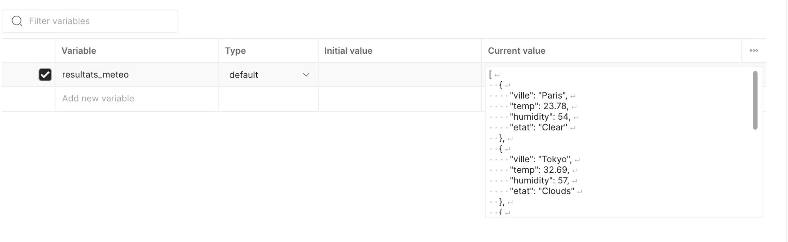

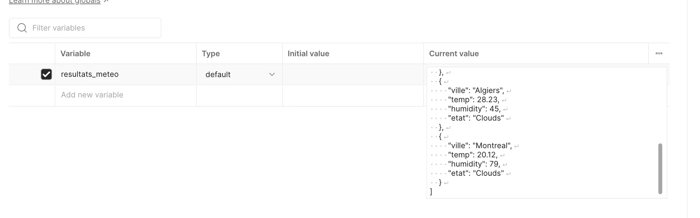

 

### Pourquoi faire ça ?

- on essaye d’automatiser la collecte des données via une API
- Structurer ces données dans un format exploitable par ex.json
- L’utiliser dans un projet IA ou data

| Objectif IA | Explication |
| --- | --- |
| **Classification** | Entraîner un modèle qui prédit `etat` (Clear, Rain...) en fonction de `temp` et `humidity`. |
| **Régression** | Prédire la température d’une ville en fonction d'autres variables (heure, humidité, etc.) |
| **Clustering** | Regrouper les villes qui ont une météo similaire |
| **Visualisation** | Générer des graphes météo (par état, température moyenne, etc.) |

### Question 5

Température dépasse 40°

je modifie mon json : cities.json

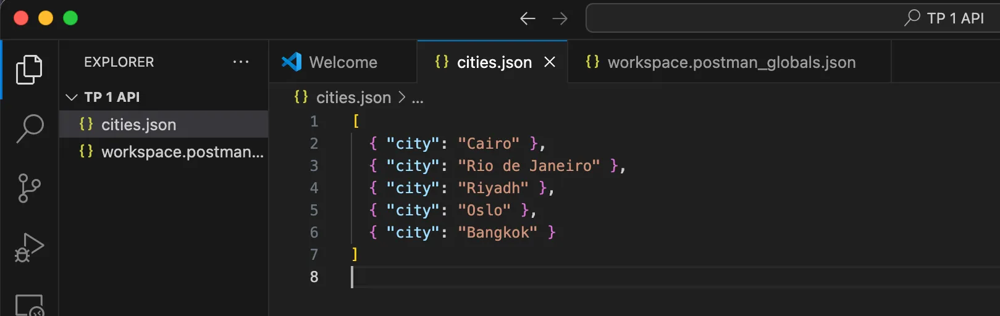

j’ajoute ce bloc de code dans ma requête (je change la température par 20 deg juste pour tester ) 

```json
// question 5
// Vérification température critique
if (data.main && typeof data.main.temp === "number") {
    const temp = data.main.temp;
    if (temp >= 20) {
        console.log("ALERTE : Température critique détectée (" + temp + "°C) !");
    } else {
        console.log("Température normale (" + temp + "°C).");
    }
}
```

**Résultat** :

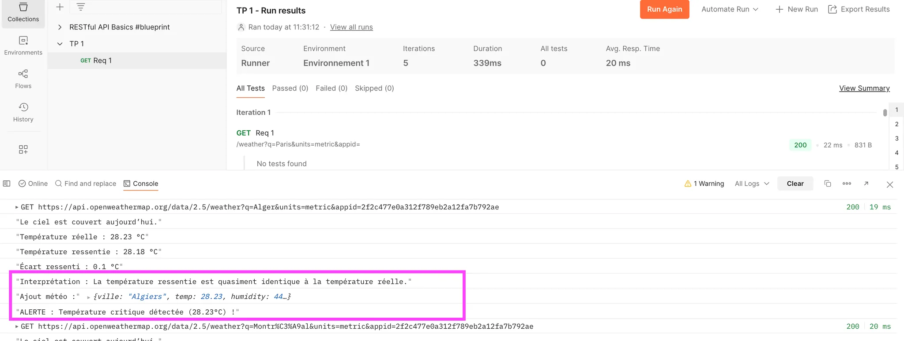

### Question 6

Ajouter ce code à la requête 

```json
/ question 6
// Déduction jour/nuit
if (data.sys && data.sys.sunrise && data.sys.sunset) {
    const now = Math.floor(Date.now() / 1000); // temps actuel en secondes
    const sunrise = data.sys.sunrise;
    const sunset = data.sys.sunset;

    if (now >= sunrise && now <= sunset) {
        console.log("Il fait jour dans la ville interrogée.");
    } else {
        console.log("Il fait nuit dans la ville interrogée.");
    }

    // Facultatif : stocker cette info dans une variable
    pm.environment.set("isDaylight", now >= sunrise && now <= sunset ? "Jour" : "Nuit");
}
```