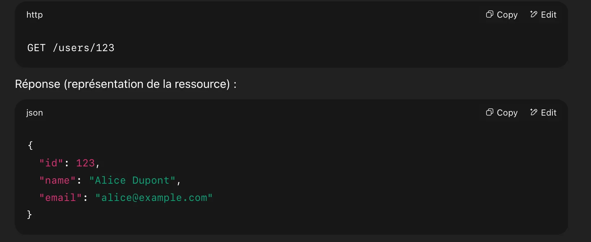
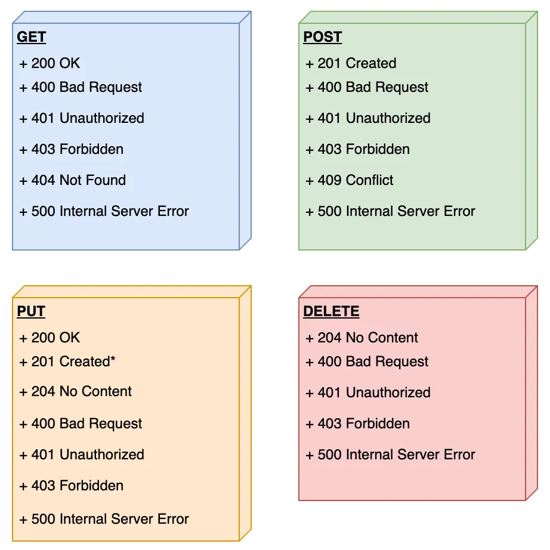
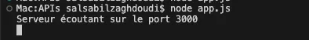
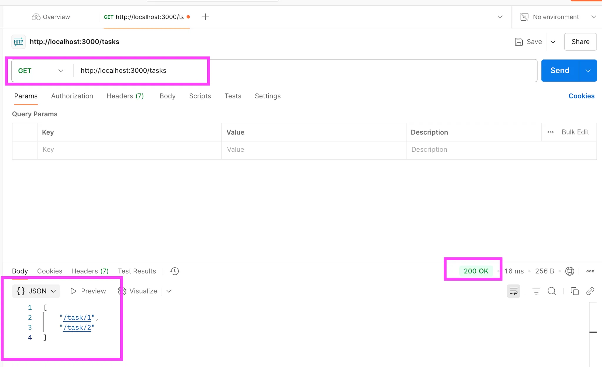
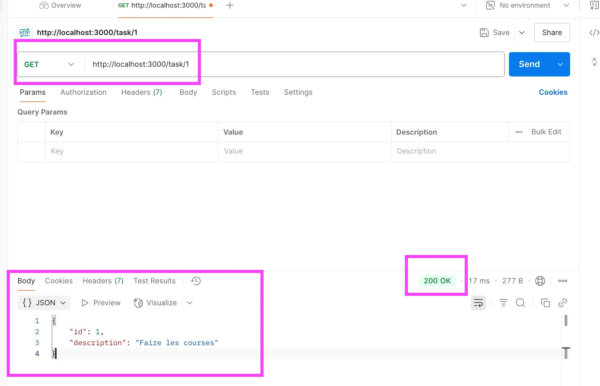
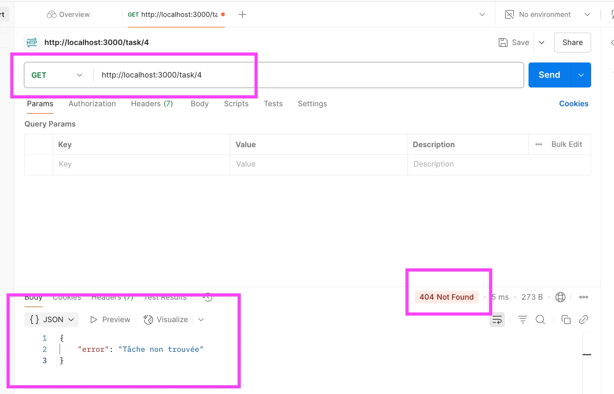
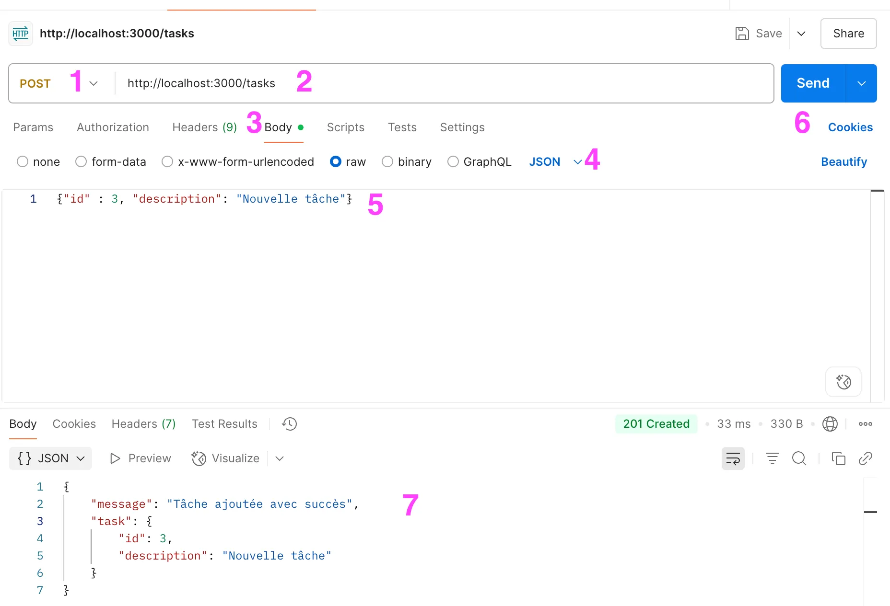
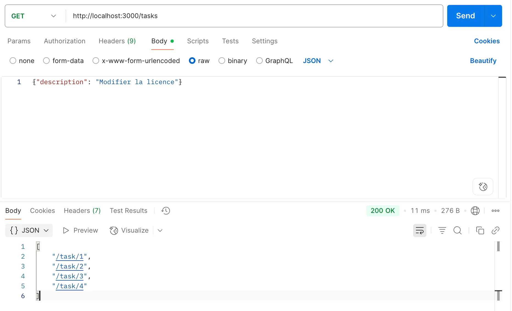
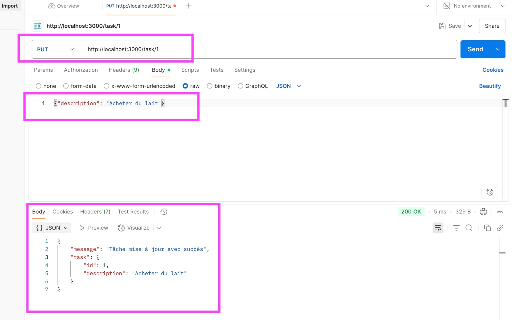

# API REST first steps

### Qu’est-ce qu’une API REST ?

Une API REST (Representational State Transfer) est une interface qui respecte un ensemble de règles destinées à garantir simplicité, clarté et uniformité. Voici les principaux principes à connaître :

### 1. Interface uniforme

Toutes les ressources doivent être accessibles via des URI (Uniform Resource Identifier).

Par exemple, si l’on manipule une ressource de type "personne", l’URI sera `/personne`.

### 2. Actions sur les ressources (méthodes HTTP)

Les opérations sur les ressources se font avec les verbes suivants :

- **GET /personne** : récupère la liste de toutes les personnes.
- **POST /personne** : ajoute une nouvelle personne.
- **PUT /personne** : modifie les informations d’une personne.
- **DELETE /personne** : supprime une personne.

### 3. Architecture client-serveur

Le client envoie des requêtes, le serveur y répond. Ce découplage permet une indépendance entre les deux parties : le client n’a pas besoin de savoir comment fonctionne le serveur, et inversement.

### 4. Sans état (stateless)

Chaque requête est indépendante : elle doit contenir toutes les informations nécessaires au traitement. Le serveur ne conserve pas de mémoire des interactions précédentes.

### 5. Représentation des ressources

Une ressource peut être renvoyée sous différentes formes (souvent en JSON ou XML), en fonction de ce que le client est capable de comprendre. C’est cette forme de réponse qu’on appelle sa “représentation”.



> **NB** : JSON est le format le plus utilisé pour échanger des données entre les API
> 

### **6. Les codes de statut HTTP :**

https://restfulapi.net/http-status-codes/



### 7.Exemple pratique : Créer une API

**Pré requis :**

VScode - Pycharm (tester l’API) - nodeJS (créer l’API) - Postman 

- Pour commencer, il faut une application web, il faut installer `express`
- Dans votre terminal, installez express : `npm install express`
- Créez un fichier app.js qui va représenter le fichier dans lequel vous allez travailler :

```jsx
const express = require('express');
const bodyParser = require('body-parser');

const app = express();
const port = 3000;

app.use(bodyParser.json());

// Les ressources de l'API : ici, des tâches simulées dans un tableau
let tasks = [
  { id: 1, description: 'Faire les courses' },
  { id: 2, description: 'Apprendre Node.js' }
];

// Démarrer le serveur
app.listen(port, () => {
  console.log(`Serveur écoutant sur le port ${port}`);
});

```

- Enregistrez le app.js (si vous enregistrez pas votre appli, le serveur ne se lancera pas)
- Lancez l’appli dans le terminal avec `node app.js`



- Maintenant, vous allez créer une instance de l’application express :
    1. **Récupérer les références vers chaque tâche :** 

Pour faire ça on va créer une constante `taskReferences`, c’est une liste qui va contenir toutes les références de toutes les tâches : 

```jsx
app.get('/tasks', (req, res) => {
  const taskReferences = tasks.map(task => `/task/${task.id}`);
  res.json(taskReferences);
});
```

- Toujours sauvegarder avant de lancer le serveur.
- Lancez l’appli : node app.js
- Du côté de Postman :



1. **Récupérer le détail des tâches :** 

On va mettre en place une route pour récupérer une tâche spécifique, on va ajouter ce bloc de code : 

```jsx
app.get('/task/:id', (req, res) => {
  const taskId = parseInt(req.params.id);
  const task = tasks.find(task => task.id === taskId);

  if (task) {
    res.json(task);
  } else {
    res.status(404).json({ error: 'Tâche non trouvée' });
  }
});
```

cmd + s : pour save toujours 😉

Lancez le serveur : node app.js 

Du côté de Postman : GET http://localhost:3000/task/1

 



si je fais [http://localhost:3000/task/](http://localhost:3000/task/1)4 : 



1. **Ajouter une tâche :** 

```jsx
app.post('/tasks', (req, res) => {
  const newTask = {
    id: tasks.length + 1,
    description: req.body.description
  };

  tasks.push(newTask);

  res.status(201).json({
    message: 'Tâche ajoutée avec succès',
    task: newTask
  });
});
```

Postman : 

1. Méthode : POST
2. URL : http://localhost:3000/tasls
3. Body : aller dans l’onglet “Body”
4. Format : Raw 
5. Contenu : "description": "Nouvelle tâche” pas besoin d’indiquer l’ID, il s’incrémente automatiquement 
6. Envoi 
7. Résultat 



Si je change de méthode : GET pour récupérer la liste de toutes les tâches 



Si je veux voir le détail de la tâche 3 : GET [`http://localhost:3000/task/3`](http://localhost:3000/task/3)

> NB : dans cet exemple, on utilise une liste statique, quand on éteint le serveur, on perd ce qu’on a ajouté, mais ce n’est pas le cas si on avait une BDD
> 
1. **Modifier une tâche avec PUT**

```jsx
// Modifier une tâche existante
app.put('/task/:id', (req, res) => {
  const taskId = parseInt(req.params.id); // Récupère l'identifiant depuis l'URL
  const task = tasks.find(task => task.id === taskId); // Cherche la tâche dans le tableau

  if (task) {
    task.description = req.body.description; // Met à jour la description
    res.json({ message: 'Tâche mise à jour avec succès', task });
  } else {
    res.status(404).json({ error: 'Tâche non trouvée' }); // Si non trouvée
  }
});
```

cmd + s 

ctrl + c = éteindre le serveur 

lancer l’appli : node app.js 



Si vous tentez de modifier les tâches 3 ou 4 que vous avez créé, ce ne sera pas possible, car le serveur a été redémarré