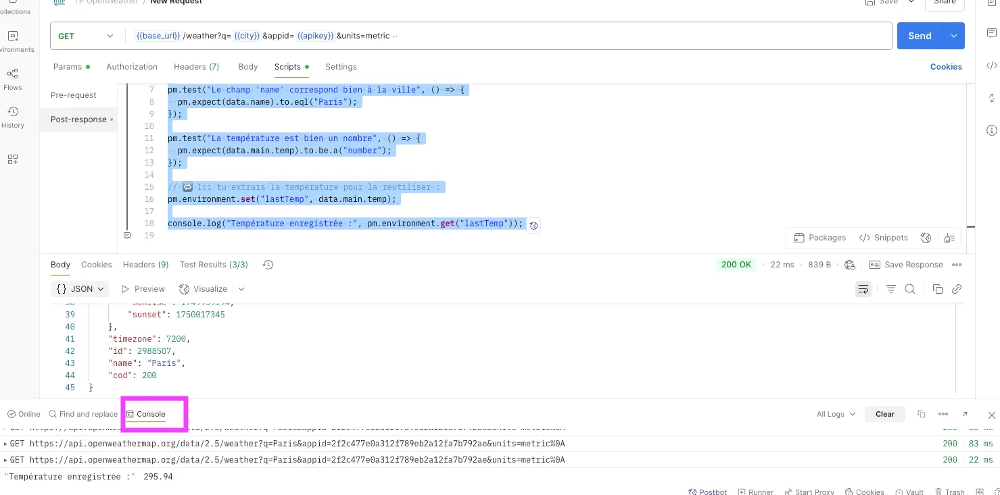

# TP 1 :  Exploration et Test d’APIs REST avec Postman et Python

### Partie 1 – Appels API et extraction de données météo via Postman

### Objectifs

Cette première partie vous permet de découvrir comment interroger une API REST publique (OpenWeatherMap) à l’aide de Postman, sans écrire de code. Vous apprendrez à :

- configurer un environnement avec des variables dynamiques,
- envoyer des requêtes GET paramétrées,
- tester les réponses via des scripts Postman,
- analyser des données météo structurées au format JSON,
- et interpréter les résultats dans un contexte métier orienté IA.

---

### Préparation du matériel

1. **Compte OpenWeatherMap**
    
    Créez un compte gratuit sur [https://openweathermap.org](https://openweathermap.org/) et récupérez votre **clé API** dans l’onglet *API Keys*.
    
2. **Postman Desktop** 
3. **Création de l’environnement Postman**
    
    Cliquez sur l’icône *Environments* > *New* et définissez les variables suivantes :
    
    - `base_url` → `https://api.openweathermap.org/data/2.5`
    - `apikey` → votre clé API (type "secret" recommandé)
    - `city` → une ville à interroger (ex. `Paris`)
    - (facultatif) `units` → `metric` pour afficher les températures en °C

---

### Étapes à suivre

### 1. Configurer et envoyer une requête

Dans une requête GET, utilisez les variables précédemment définies pour construire dynamiquement l’URL :

```
{{base_url}}/weather?q={{city}}&units=metric&appid={{apikey}}
```

Cela permet de réutiliser la même requête pour n’importe quelle ville, en changeant simplement la valeur de la variable `city`.

La réponse contient plusieurs blocs d’informations structurés : latitude, longitude … 

---

### 2. Ajouter des tests Postman

1. Cliquez sur l’onglet **Scripts**.
2. Dans la zone intitulée `Post-response`, collez le code suivant :

```jsx
pm.test("Statut HTTP = 200", () => {
  pm.response.to.have.status(200);
});

const data = pm.response.json();

pm.test("Le champ 'name' correspond bien à la ville", () => {
  pm.expect(data.name).to.eql("Paris");
});

pm.test("La température est bien un nombre", () => {
  pm.expect(data.main.temp).to.be.a("number");
});

// 🔁 Ici tu extrais la température pour la réutiliser :
pm.environment.set("lastTemp", data.main.temp);

console.log("Température enregistrée :", pm.environment.get("lastTemp"));
```

Ce code vérifie que la réponse HTTP est correcte (code 200), que la ville renvoyée est bien "Paris", et que la température est un nombre. Ensuite, il stocke la température dans une variable d’environnement `lastTemp`. Enfin, il affiche cette température dans la console Postman.

Pour le tester, cliquez sur Console en bas à gauche : 



Ici la requête renvoie la température en Kelvin, vous pouvez modifier la requête pour la renvoyer en Celsius.

---

### À vous de jouer :

1. **Modifiez la requête actuelle** pour interroger dynamiquement plusieurs villes successivement via le Runner de Postman. Comment automatiser cela sans modifier la requête à chaque fois ?
2. **Stockez dans une variable d’environnement** la description de la météo (`weather[0].main`). Proposez ensuite un script conditionnel qui affiche un message spécifique selon les cas (`Rain`, `Clear`, etc.).
3. **Exploitez la donnée `feels_like`** fournie dans le bloc `main`. Affichez dans la console la différence entre `temp` et `feels_like` et interprétez ce que cela peut signifier dans un système IA contextuel.
4. **Enregistrez dans une collection JSON structurée** les températures de 5 villes, avec leur nom, température, humidité et état du ciel. Comment pourriez-vous transformer ce JSON en dataset utilisable pour un modèle prédictif météo ?
5. **Ajoutez un script de vérification** qui signale si la température dépasse une valeur critique (ex. 40 °C). Si c’est le cas, générez une alerte simulée.
6. **Récupérez la météo actuelle et l’heure de lever/coucher du soleil**, puis ajoutez un test logique qui déduit s’il fait jour ou nuit au moment de l’appel API.
7. **Comparez deux villes** (ex. Alger vs Montréal) sur au moins 3 indicateurs météo et générez une sortie structurée dans la console. Comment automatiser cette comparaison dans une collection ?

---

## Partie 2 – Reproduire un appel API sécurisé en Python avec Spotify

### Objectif

Dans cette partie, vous allez **reproduire par vous-même** l’ensemble des manipulations présentées dans la vidéo suivante :

 [**https://www.youtube.com/watch?v=WAmEZBEeNmg**](https://www.youtube.com/watch?v=WAmEZBEeNmg)

Elle vous guide pas à pas dans l’utilisation de la bibliothèque `requests` en Python pour :

- vous **authentifier auprès de l’API Spotify** avec un token (OAuth 2.0),
- et effectuer une **requête API REST** pour interroger des ressources publiques (ex. artistes, titres).

Notes

Transcript

		

### Livrables

**Partie 1** : les réponses aux questions 1-7

**Partie 2 :** Un tuto sous format PDF qui résume les manipulations présentées dans la vidéo