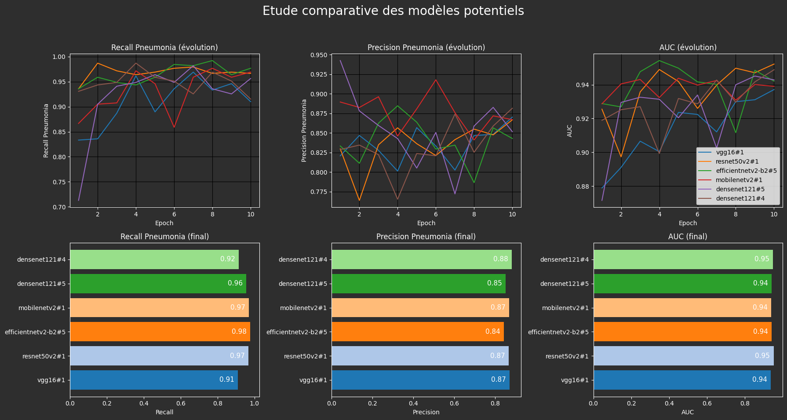
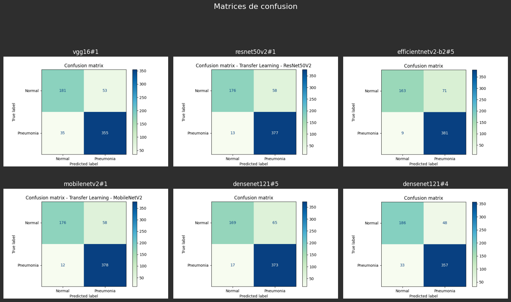
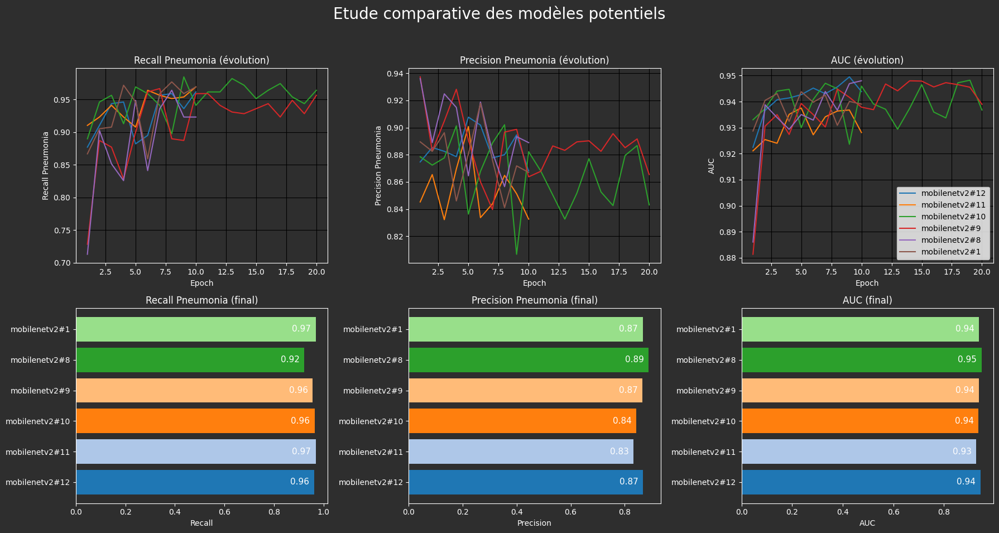
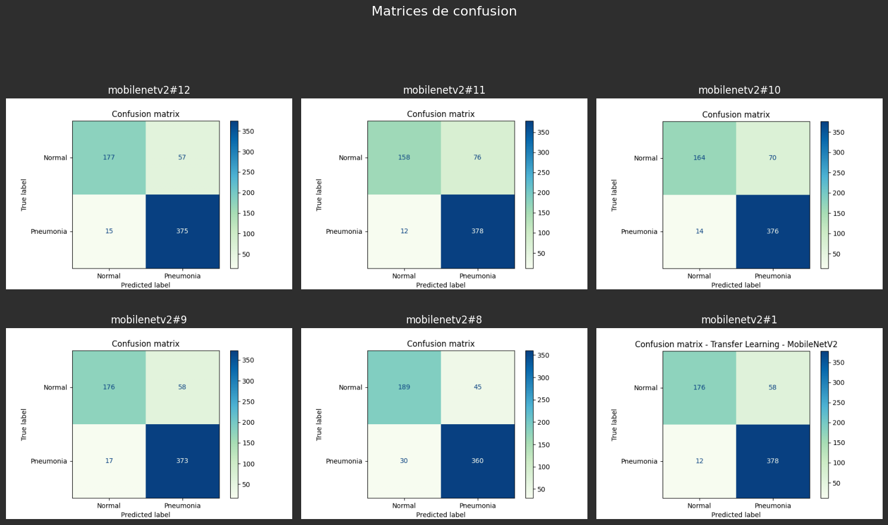

# 🩺 Détection de la Pneumonie avec Transfer Learning

Bienvenue dans ce notebook de démonstration qui illustre l’utilisation du **transfer learning** pour détecter la pneumonie à partir d’images médicales (scanners thoraciques).

---

## 📋 Description du projet

Nous exploitons le dataset **[Chest XRay Pneumonia](https://www.kaggle.com/datasets/paultimothymooney/chest-xray-pneumonia)** pour affiner un modèle pré-entraîné Keras et classer des images en présence ou non de pneumonie.

Le notebook suit un workflow clair et structuré, en 9 étapes :

| Étape | Description |
|-------|-------------|
| 1️⃣ | **Compréhension du problème** : analyser la problématique pour guider nos choix techniques et métriques. |
| 2️⃣ | **Analyse du dataset** : explorer les données, leur format, et la répartition des classes. |
| 3️⃣ | **Préprocessing** : adapter les images au format attendu par le modèle. |
| 4️⃣ | **Création du modèle** : construction via une fonction paramétrable. |
| 5️⃣ | **Entraînement** : apprentissage avec suivi des performances à chaque epoch. |
| 6️⃣ | **Suivi avec MLflow** : enregistrer paramètres et résultats pour comparaison. |
| 7️⃣ | **Sélection du meilleur modèle** : comparaison des modèles testés via MLflow. |
| 8️⃣ | **Optimisation** : ajustement des hyperparamètres pour maximiser les performances. |
| 9️⃣ | **Résultats finaux** : présentation du modèle final prêt à l’usage. |

Une **grande importance a été donnée à la modularité**, avec :
- un dictionnaire `params` centralisant tous les paramètres du modèle et de l'entraînement ;
- une liste `added_layers` décrivant dynamiquement les couches ajoutées au modèle de base ;
- une fonction unique de construction de modèle, flexible et facilement réutilisable ;
- un **suivi complet via MLflow**, pour faciliter les expérimentations et comparaisons.

---

## 🔁 Workflow détaillé

### 1️⃣ Compréhension du problème

La première étape consiste à bien cerner notre objectif. Cela nous aide à :
- choisir les bonnes **métriques de performance** (ex. : précision, rappel),
- anticiper les **défis liés aux données médicales**,
- orienter les choix de modèles et stratégies de validation.

### 2️⃣ Analyse du dataset

Nous explorons les données :
- formats d'image,
- structure des dossiers,
- **répartition des classes** (pneumonie / normal),
- équilibrage éventuel des classes pour un entraînement juste.

### 3️⃣ Preprocessing du dataset

Les images sont adaptées aux exigences des modèles pré-entraînés :
- redimensionnement,
- conversion en RGB si besoin,
- normalisation,
- génération de lots (batches).

### 4️⃣ Création du modèle

Le modèle est généré via une fonction modulaire et paramétrable selon un dictionnaire centralisé :

```python
params = {
    "rgb": False,
    "include_top": False,
    "input_tensor": None,
    "classifier_activation": "softmax",
    "alpha": 0.35,
    "weights": "imagenet",
    "strategy": "no_tuning",
    "fixed_layers": 100,
    "epochs": 1,
    "batch_size": 100,
    "img_size": 224,
    "input_shape": (224, 224, 3),
    "pooling": "max",
    "equilibrate": True,
    "optimizer": "adamw",
    "loss": "categorical_crossentropy",
    "data_augmentation": True,
    "include_preprocessing": False,
    "model": "mobilenetv2"
}
```

Les couches ajoutées au modèle de base sont également définies dynamiquement :

```python
added_layers = [
    {"type": "dropout", "count": 0.3},
    {"type": "dense", "count": 128, "activation": "relu"},
    {"type": "dropout", "count": 0.2},
    {"type": "dense", "count": 2, "activation": "softmax"}
]
```

Ce système permet de tester rapidement plusieurs architectures et combinaisons.

5️⃣ Entraînement du modèle
Entraînement avec suivi des performances à chaque epoch :

précision,

perte,

courbes de validation.

6️⃣ Suivi avec MLflow
Chaque test est journalisé avec MLflow :

paramètres (params, modèle utilisé, taux de dropout...),

métriques obtenues,

version du modèle sauvegardée.

👉 Accès à l'interface : http://mflow-demo.cpetit.fr
🧪 Identifiants de test : testuser / testpassword

7️⃣ Sélection du meilleur modèle
Les résultats sont comparés via l’interface MLflow pour identifier :

le modèle le plus performant,

les paramètres les plus stables.




8️⃣ Optimisation
Sur le modèle choisi, nous testons :

différents taux d’apprentissage,

différentes fonctions de perte,

architectures de couches ajoutées.




9️⃣ Résultats finaux
Le modèle final est présenté avec ses performances :

sur l'ensemble de test,

en comparatif avec les précédents,

prêt à être réutilisé ou déployé.

---

## 🚀 Utilisation

Pour utiliser ce notebook, suivez les étapes ci-dessous :

```bash
# 1. Créer un environnement virtuel Python < 3.13 (TensorFlow n'est pas encore compatible avec la dernière version de Python)

# 2. Installer les dépendances depuis le terminal
pip install -r requirements.txt
```

L’interface MLflow sera accessible sur : http://mflow-demo.cpetit.fr avec les identifiants testuser / testpassword

Ouvrez le notebook et exécutez les cellules dans l’ordre pour reproduire l’entraînement et l’évaluation.

---

Les images utilisées pour l'entraînement, la validation et le test proviennent du jeu de données suivant :

https://www.kaggle.com/datasets/paultimothymooney/chest-xray-pneumonia
Licence : CC BY 4.0

⚠️ Utilisation dans ce projet à but pédagogique uniquement.